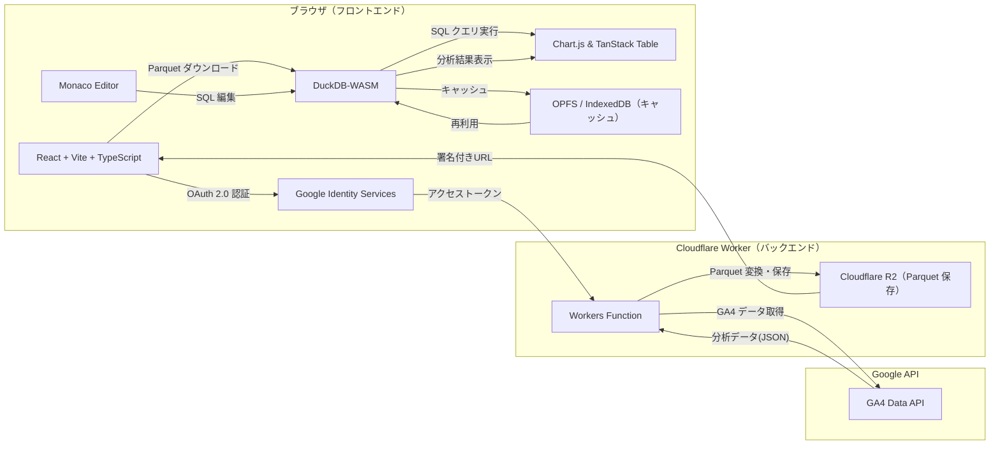
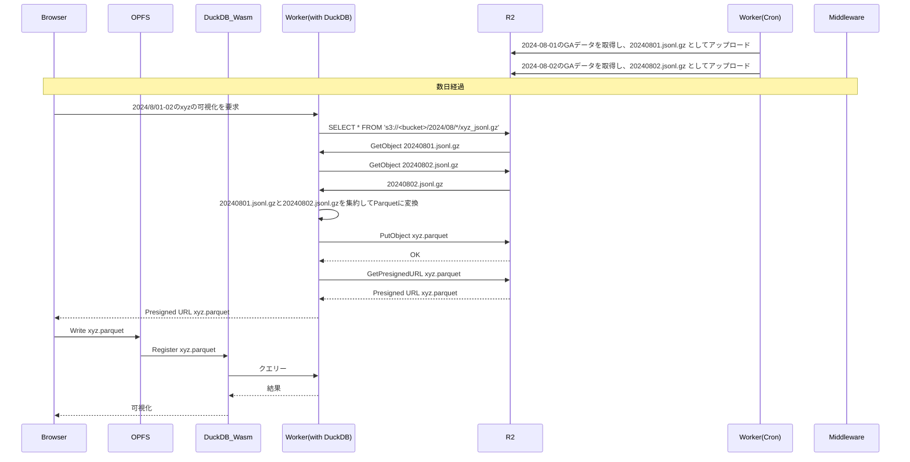

# アーキテクチャ図

 以下は本アプリの高レベルなアーキテクチャ図です。ブラウザ（フロントエンド）と
 Cloudflare Workers（バックエンド）、および外部サービス連携の流れを示しています。

 ## 説明
 - ブラウザ上で React+TypeScript の SPA として動作し、Google Identity Services で OAuth2 認証を行う
 - 認証情報を Workers に渡し、GA4 Data API から生データを取得、Parquet に変換して R2 に保存
 - 保存した Parquet は署名付き URL 経由でブラウザにダウンロードされ、DuckDB-WASM でクエリ可能
 - Monaco Editor で SQL を編集し、Chart.js / TanStack Table で可視化
 - OPFS / IndexedDB を利用して Parquet データとクエリをローカルキャッシュ
